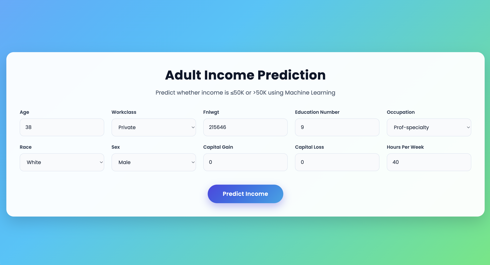
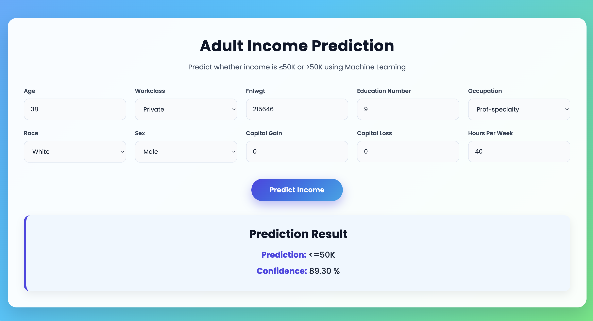

# Annual Income Prediction using Machine Learning

An end-to-end Machine Learning project that predicts whether an individual's annual income exceeds **$50K** based on demographic and employment-related attributes. The project is built using **Scikit-Learn**, with a complete preprocessing pipeline and model serialization using **Joblib**.

The dataset used is the **Adult Census Income Dataset** from the **UCI Machine Learning Repository**.

---

## Project Overview

This project demonstrates the complete supervised machine learning workflow, including:

- Data collection from the UCI Machine Learning Repository
- Data preprocessing
- Exploratory Data Analysis (EDA)
- Handling missing values
- Feature encoding
- Building a preprocessing pipeline
- Model training and evaluation
- Model serialization using Joblib

The trained model is stored as a reusable pipeline, making it ready for deployment in a web application or REST API.

---

## Dataset

**Dataset:** Adult Census Income Dataset

**Source:** UCI Machine Learning Repository

https://archive.ics.uci.edu/dataset/2/adult

### Problem Statement

Predict whether an individual's annual income is:

- **<= 50K**
- **> 50K**

based on census demographic and employment information.

---

## Dataset Features

The dataset contains information such as:

| Feature | Description |
|----------|-------------|
| Age | Age of the individual |
| Workclass | Employment type |
| fnlwgt | Final sampling weight |
| Education | Highest education level |
| Education-num | Years of education |
| Marital-status | Marital status |
| Occupation | Occupation type |
| Relationship | Relationship status |
| Race | Race |
| Sex | Gender |
| Capital-gain | Capital gain |
| Capital-loss | Capital loss |
| Hours-per-week | Weekly working hours |
| Native-country | Country of origin |
| Income | Target Variable |

---

## Project Structure

```
Annual-Income-Prediction/
│
├── data/
│   ├── adult.data
│   └── adult.test
│
├── model/
│   └── adult_salary_pipeline.joblib
│
├── model_training.ipynb
├── requirements.txt
├── requirements-dev.txt
└── README.md
```

---

## Project Workflow

The project follows these steps:

1. Load the Adult Census Income dataset.
2. Perform exploratory data analysis.
3. Handle missing values.
4. Encode categorical variables.
5. Build a preprocessing pipeline.
6. Train a Machine Learning classification model.
7. Evaluate model performance.
8. Save the trained preprocessing pipeline and model using Joblib.

---

## Machine Learning Pipeline

The saved pipeline performs:

- Missing value handling
- Categorical feature encoding
- Numerical feature transformation
- Complete preprocessing
- Classification model inference

Saving the entire preprocessing pipeline ensures consistent predictions on unseen data.

---

## Technologies Used

| Category | Technology |
|----------|------------|
| Programming Language | Python |
| Machine Learning | Scikit-Learn |
| Data Processing | Pandas, NumPy |
| Visualization | Matplotlib, Seaborn |
| Model Serialization | Joblib |
| Notebook | Jupyter Notebook |
| Version Control | Git & GitHub |

---

## Model Output

The model predicts one of the following classes:

| Prediction | Meaning |
|------------|---------|
| <=50K | Annual income is less than or equal to $50,000 |
| >50K | Annual income exceeds $50,000 |

---

## Running the Project

### Clone the Repository

```bash
git clone https://github.com/datasciencekibaatein/Annual-Income-Prediction.git
```

```bash
cd Annual-Income-Prediction
```

### Create Virtual Environment

Windows

```bash
python -m venv venv
```

macOS/Linux

```bash
python3 -m venv venv
```

### Activate Virtual Environment

Windows

```bash
venv\Scripts\activate
```

macOS/Linux

```bash
source venv/bin/activate
```

### Install Dependencies

```bash
pip install -r requirements.txt
```

### Launch Jupyter Notebook

```bash
jupyter notebook
```

Open

```
model_training.ipynb
```

---

## Learning Outcomes

This project demonstrates practical implementation of:

- Exploratory Data Analysis
- Data Cleaning
- Missing Value Handling
- Feature Engineering
- Categorical Encoding
- Machine Learning Pipelines
- Classification Algorithms
- Model Evaluation
- Joblib Model Serialization
- Production-ready Machine Learning Workflow

---

## Future Improvements

Possible enhancements include:

- FastAPI deployment
- Interactive web application
- Docker support
- CI/CD pipeline
- Model monitoring
- Hyperparameter tuning
- Feature importance visualization
- Cloud deployment on Render or Azure

---

## Screenshots

### Homepage





### Output





---

## Contributing

Contributions are welcome. Feel free to fork the repository and submit pull requests.

---

## License

This project is intended for educational and learning purposes.

---

## Author

**Dhruv**

Data Science Instructor

Areas of Interest

- Machine Learning
- Deep Learning
- Generative AI
- MLOps
- Model Deployment

GitHub: https://github.com/datasciencekibaatein

LinkedIn: https://linkedin.com/in/dhruv6397